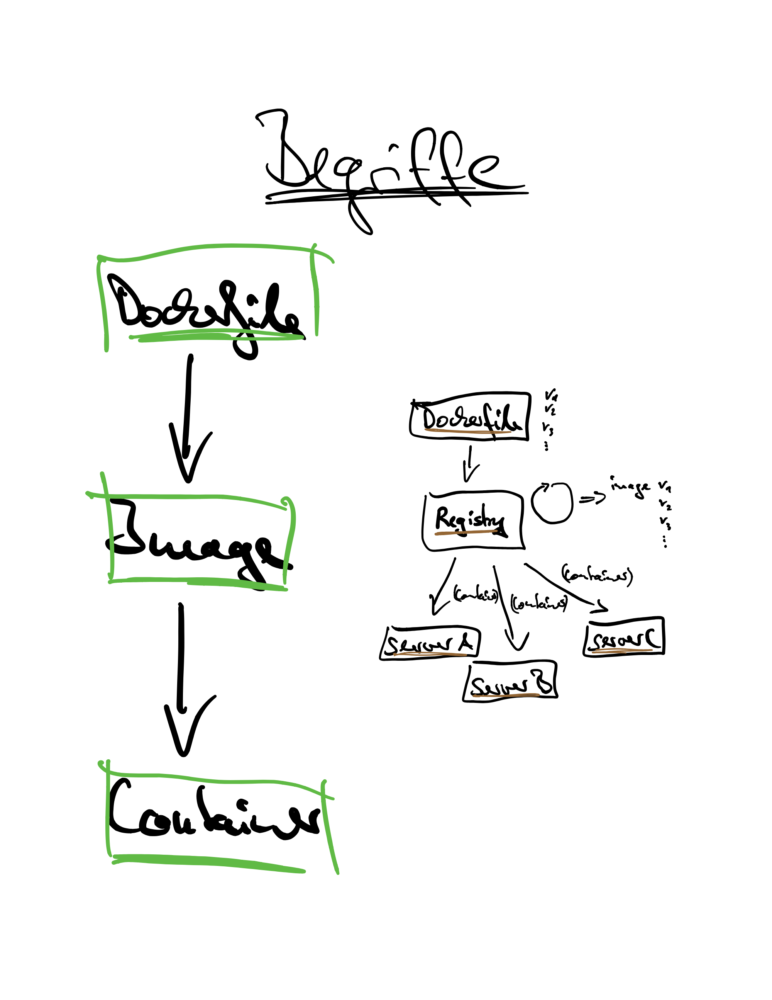

# Docker Workshop

Getting started with Docker - a hands on workshop:

* [workshop notes](Workshop.md)
* [workshop slides](slides.pdf)
* [workshop examples](examples)



## setup Rancher v1.6 on AWS
 
Rancher is an orchestration platform that comes with a nice UI and is a great way to demonstrate docker in action. Provisioning EC2 instances and configuring Rancher can be pretty time consuming. Especially if you would like to demonstrate Continuous Integration (with automated testing and deployments).
If you are interested in automating this task, then learn more about how to setup Rancher v1.6 on AWS:

[Read more](scripts/README.md)


## directory structure:
```
examples/    # workshop execrises
scripts/     # automatically setup Rancher on AWS
Workshop.md  # workshop notes
slides.pdf   # workshop slides
```