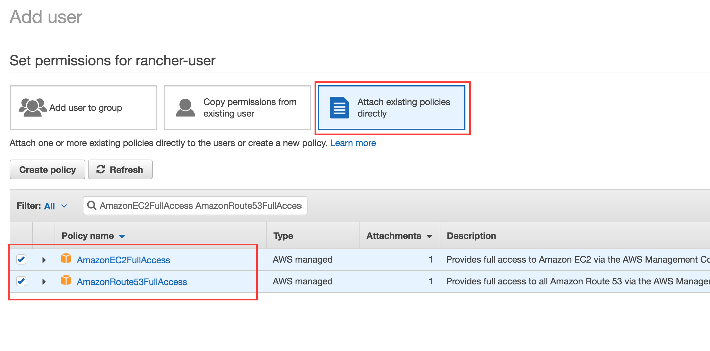
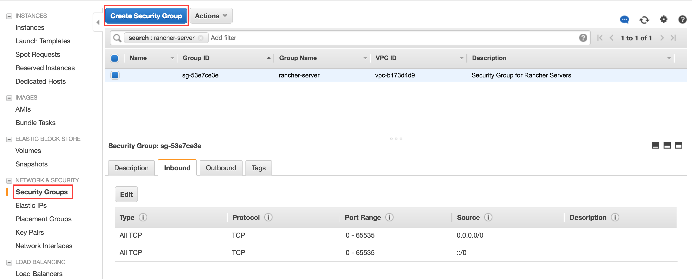

## Configure-AWS

Before we can get up and running with our scripts, we need to go to AWS via the web console and create a user, give the user permissions to interact with specific services, and get credentials to identify that user. EC2 instances also need security groups to restrict TCP traffic and to log into the new created instances we will be using ssh-keys which also need to be generated.

### Create-IAM-User

Open your browser and navigate to the AWS login page https://console.aws.amazon.com/console/home.

Once you are logged into the console, navigate to the Identity and Access Management (IAM) console. 

aws-iam-create-user: Select "Users" -> "Add user"

aws-iam-new-user: Give it a proper name and specify programmatic access type.

aws-iam-permissions: Attach existing policies: AmazonEC2FullAccess AmazonRoute53FullAccess

### Create Security Group

Navigate to the Elastic Cloud (EC2) console. 

aws-ec2-create-security-group: Select "Security Groups" -> "Create Security Group"

aws-ec2-create-security-group-new-rule: Spedify open ports for inbound and outbound traffic (for simplicity reasons I chose to make all ports open).

### Create Key Pairs

aws-ec2-create-key-pair: Select "Key Pairs" -> "Create Key Pair"

aws-ec2-create-key-pair-name: provide a suitable name.
