# Setting up Rancher v1.6 on AWS (fully scripted)

Want to get started with a simple administration frontend for your Docker containers? Do you want to give a small introduction to Docker and demonstrate its practical use with a web UI?

This document will guide you through an automated initial setup so that you can spin up an environment for the next workshop.

features:
* provision and configure EC2 instances
* install rancher 1.6 (rancher server and multiple rancher hosts)
* configure DNS entries in Route53 (e.g. hello.example.com, groupbox.example.com)

bonus features:
* deploy your docker containers to rancher
* install and configure drone.io CI Server


description:


## Table of Content

* [What is rancher?](#What is rancher?)
* [Configure AWS](#Configure AWS)
* [Execute Scripts (dockerized)](#Execute Scripts (dockerized))
* [Bonus Features](#Bonus Features)
* [Closing Notes](#Closing Notes)
* [Technologies](#Technologies)
* [sources](#sources)


## What is rancher?

Rancher is an orchestration plattform that manages your multi-container Docker applications. Rancher extends the default docker-compose.yml functionality with an additional file called rancher-compose.yml (scaling, healthchecks, loadbalancing).


description:

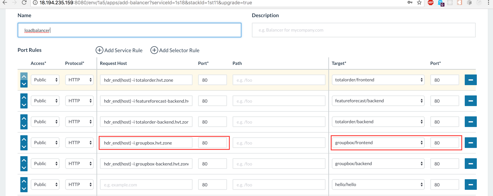
description:

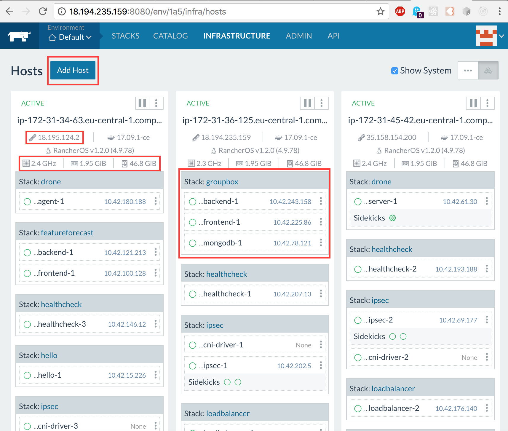
description:

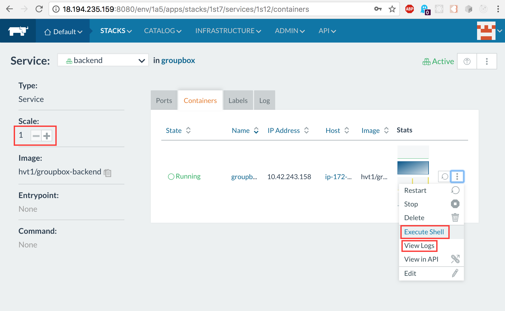
description:

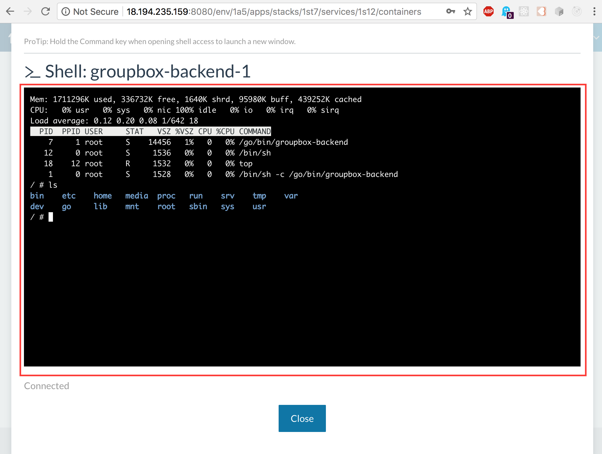
description:

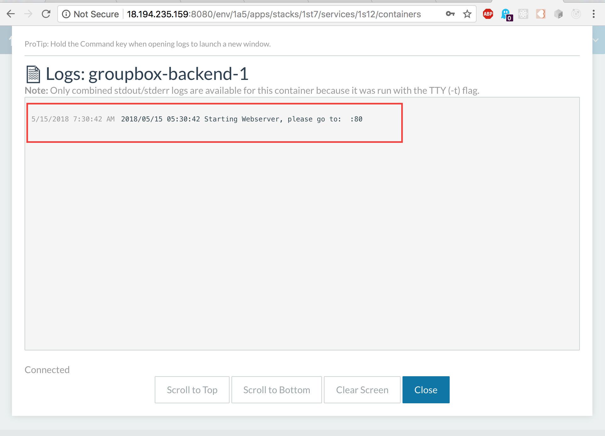
description:


## Configure AWS

AWS users, permissions, credentials, security groups, ssh keys

Before we can get up and running with our scripts, we need to go to AWS via the web console and create a user, give the user permissions to interact with specific services, and get credentials to identify that user. EC2 instances also need security groups to restrict TCP traffic and to log into the new created instances we will be using ssh-keys which also need to be generated.

### Create IAM User

Open your browser and navigate to the AWS login page https://console.aws.amazon.com/console/home.

Once you are logged into the console, navigate to the Identity and Access Management (IAM) console. Select "Users" -> "Add user."

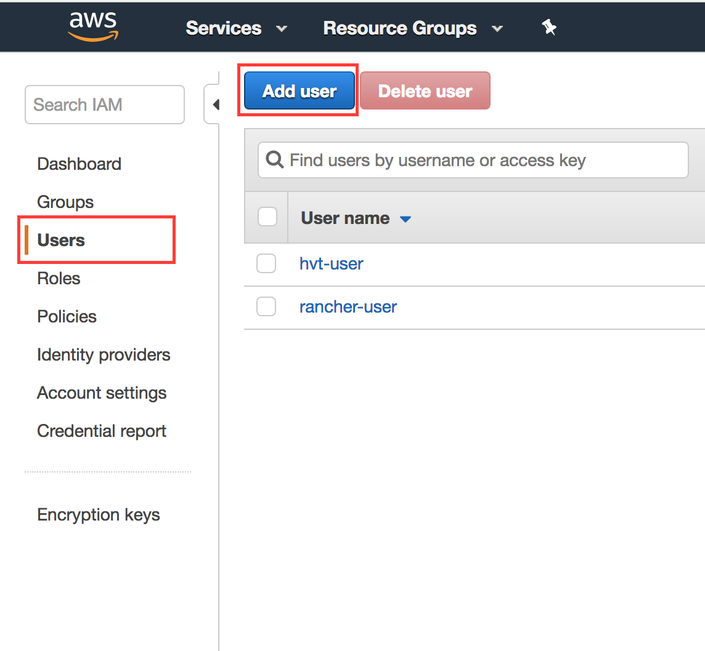
description:

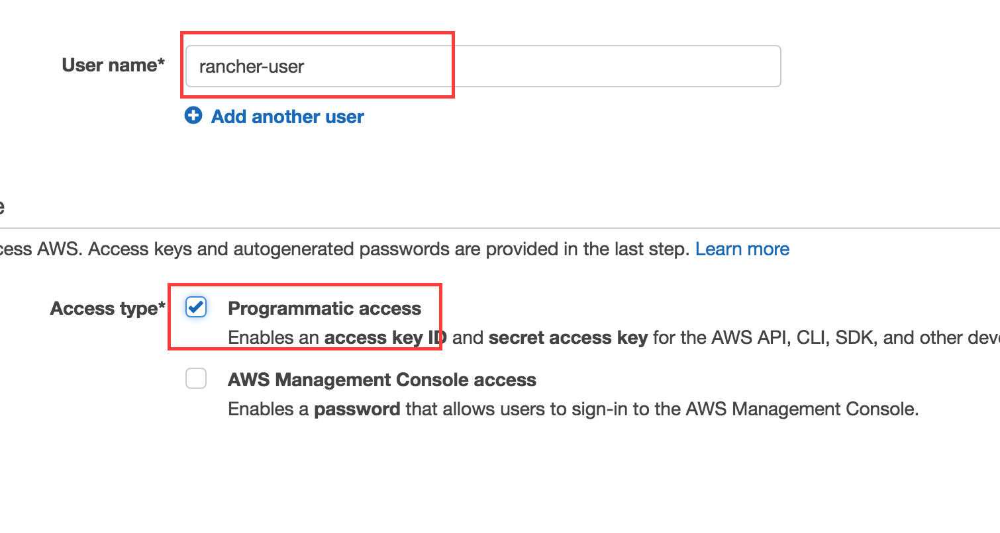
description:

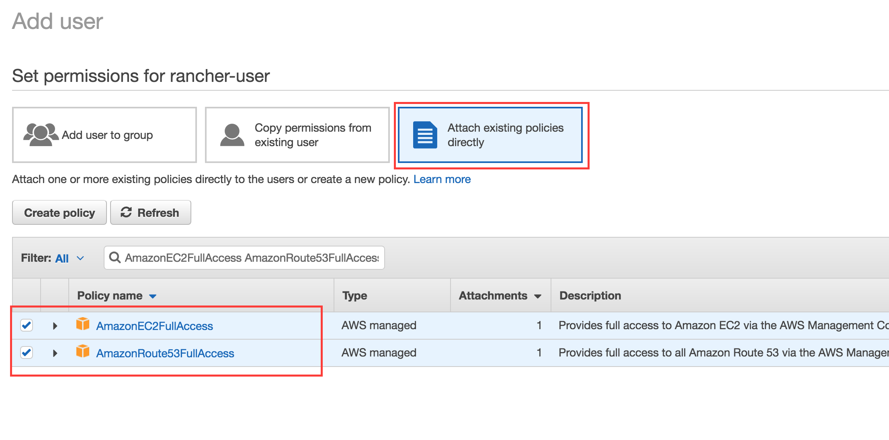
description:


### Create Security Group

Navigate to the Elastic Cloud (EC2) console. Select "Security Groups" -> "Create Security Group"


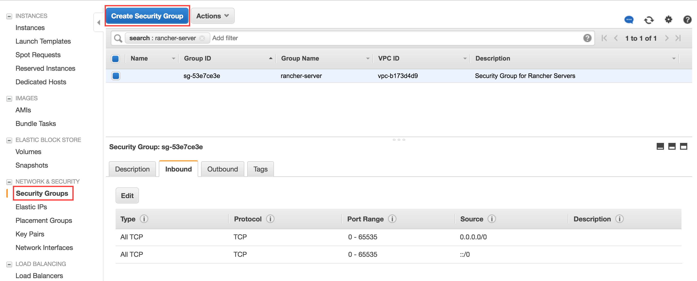
description:

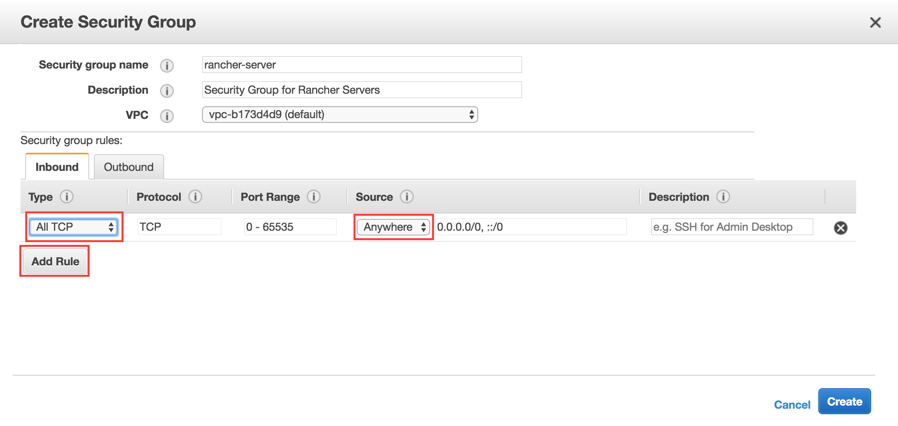
description:


### Create Key Pairs

Select "Key Pairs" -> "Create Key Pair"

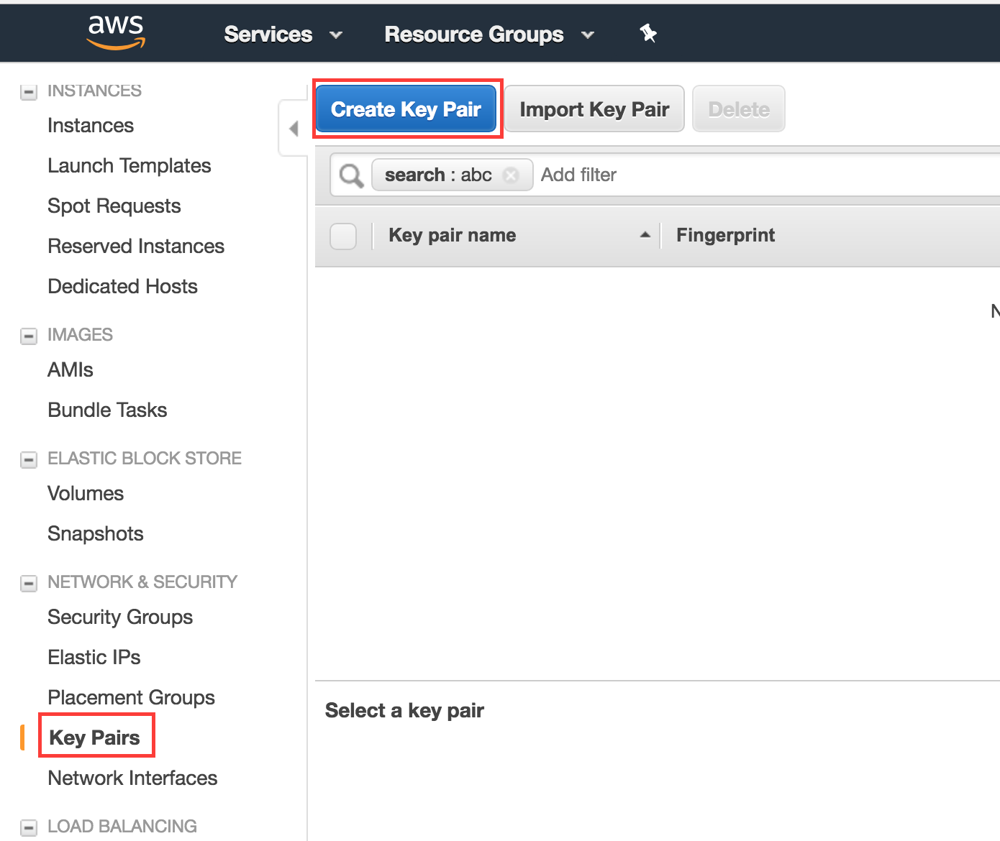
description:

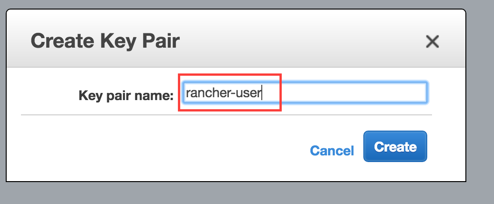
description:


## Execute Scripts (dockerized)


```
cd provision-and-configure-servers

# provide aws ssh-key to login into ec2 instance
cp ~/Downloads/rancher-user.pem id_rsa.pem

# provide usernames, credentials, passwords, security groups, ssh keys
cp run.example run.sh
vi run.sh

# build and execute scripts
docker build --tag provision-and-configure-servers .
docker run provision-and-configure-servers

# stop container if something goes wrong
docker ps
docker stop <container id>
```

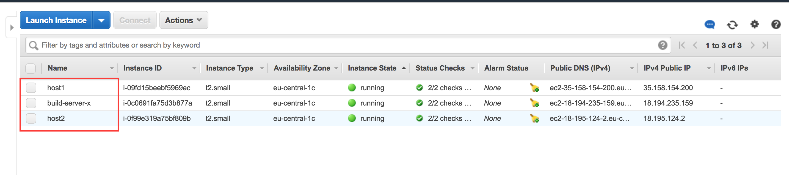
description:


description:

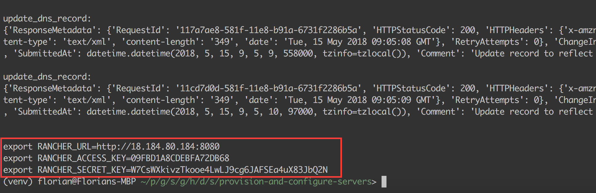
description:

## Bonus Features

### deploy your docker containers to rancher 

Description TODO

```
cd deploy-hvt-apps

# configure provide credentials, secrets, passwords, usernames, ...
cp run.example run.sh
vi run.sh

# build and execute scripts
docker build --tag deploy-hvt-apps .
docker run deploy-hvt-apps
```

### install and configure drone.io CI Server

Description TODO

visit http://drone.hvt.zone/account/token to get DRONE_TOKEN

```
cd configure-drone-ci

# configure provide credentials, secrets, passwords, usernames, ...
cp run.example run.sh
vi run.sh

# build and execute scripts
docker build --tag configure-drone-ci .
docker run configure-drone-ci
```

## Closing Notes

(pay attention to your credentials, secure your AWS instances)


## Technologies

* Python (boto3, pexpect)
* AWS (aws CLI, EC2, Route53)
* Docker (RancherOS, Rancher 1.6, Rancher CLI)
* Drone (Drone CLI)

## sources

project structure:
* https://www.kennethreitz.org/essays/repository-structure-and-python
* https://stackoverflow.com/a/1783482/5011904

python virtual environment:
* https://docs.python.org/3/tutorial/venv.html#creating-virtual-environments

aws, python and drone:
* https://linuxacademy.com/howtoguides/posts/show/topic/14209-automating-aws-with-python-and-boto3
* http://tleyden.github.io/blog/2016/02/15/setting-up-a-self-hosted-drone-dot-io-ci-server/

python libraries:
* https://boto3.readthedocs.io/en/latest/index.html
* https://pexpect.readthedocs.io/en/stable/

scripting inspiration:
* https://github.com/jeff1evesque/machine-learning/blob/508f572357966d621026ff144731a29c6faed939/install_rancher
* https://gist.github.com/mathuin/ed0fa5666e4f063b94abb5b1a49d9919

automate drone setup
* https://github.com/drone/drone/issues/2129

drone:
* http://docs.drone.io/cli-installation/

rancher:
* https://rancher.com/docs/rancher/v1.6/en/cli/commands/
* https://rancher.com/docs/rancher/v1.6/en/api/v1/
