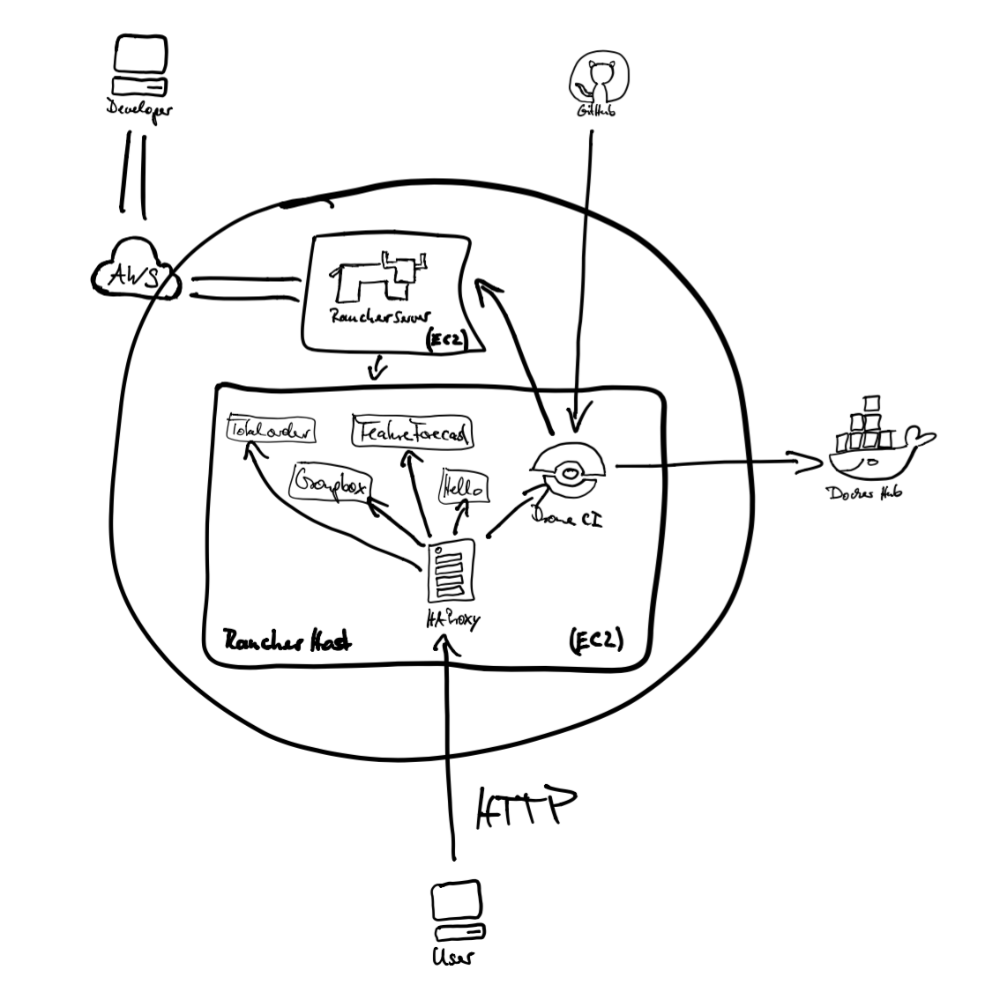
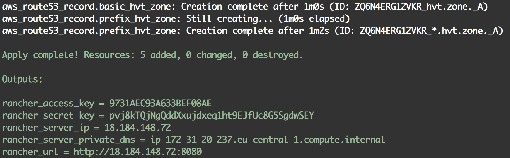
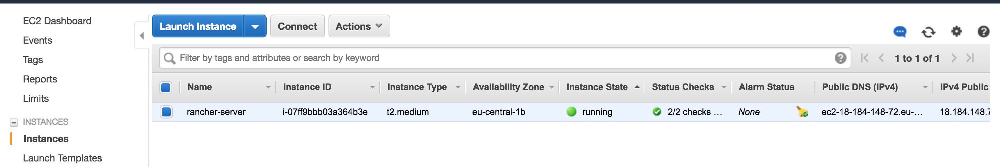
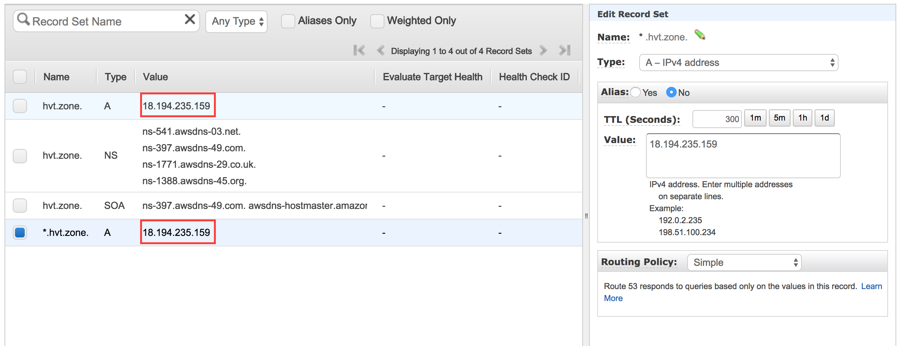
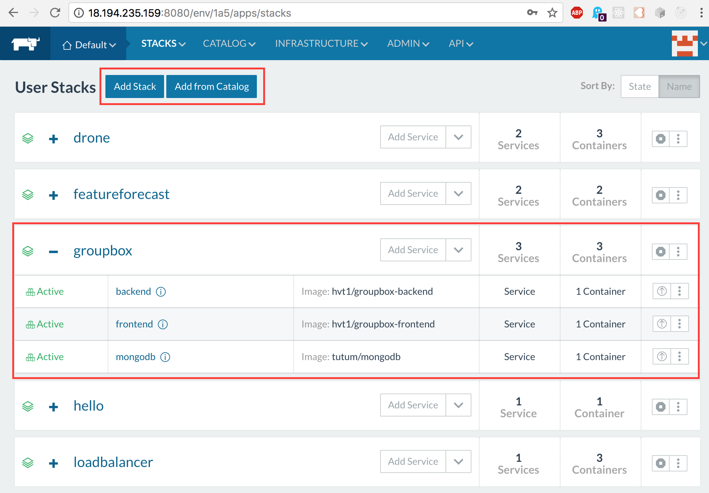
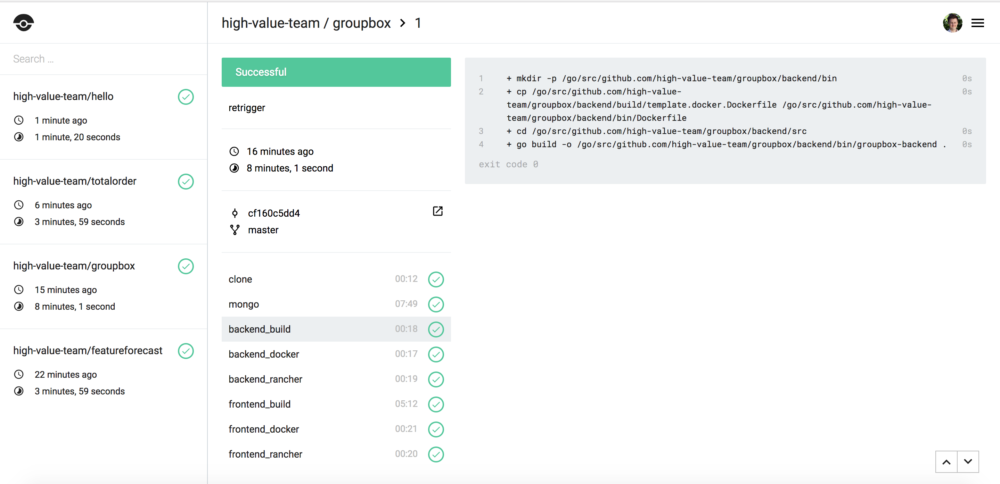

# Setting up Rancher v1.6 on AWS (fully scripted)

Do you want to get started with a simple administration frontend for your Docker containers? Want to give a small introduction to Docker and demonstrate its practical use with a web UI? It takes 5 minutes to get everything up and running.

This document will guide you through an automated setup so that you can spin up an environment for the next workshop.

features:
* provision and configure EC2 instances
* install rancher 1.6 (rancher server and rancher host)
* ~~add multiple rancher hosts~~ (a bug needs to be fixed first)
* configure DNS entries in Route53 (e.g. hello.example.com, groupbox.example.com)

bonus features:
* deploy your multi-container Apps to rancher
* install and configure drone.io CI Server



description:


## Table of Content

* [What-is-rancher](#What-is-rancher)
* [Configure-AWS](#Configure-AWS)
* [Execute-Scripts](#Execute-Scripts)
* [Bonus-Features](#Bonus-Features)
* [Closing-Notes](#Closing-Notes)
* [Technologies](#Technologies)
* [sources](#sources)


## What-is-rancher

Rancher is an orchestration plattform that manages your multi-container Docker applications. Rancher extends the default docker-compose.yml functionality with an additional file called rancher-compose.yml (scaling, healthchecks, loadbalancing). 

[Read more](rancher-intro.md)

## Configure-AWS

Before we can get up and running with our scripts, we need to go to AWS via the web console and create a user, give the user permissions to interact with specific services, and get credentials to identify that user. EC2 instances also need security groups to restrict TCP traffic and to log into the new created instances we will be using ssh-keys which also need to be generated.

* Create-IAM-User (user, permissions, credentials)
* Create Security Group
* Create Key Pairs

[Read more](configure-aws.md)

## Execute-Scripts

```
# creates EC2 instance and installs rancher server
./run-setup-golden-server
```


setup-golden-server-done: Once the scrip stops, it will print important environment variables are needed for the config files in the following steps

```
# install rancher host on previously created EC2 instance
./run-setup-golden-host
```


aws-ec2-instance: You should see the newly created instance on your EC2 dashboard. 


aws-route53-hosted-zone-records: The DNS Records will also be modified according to your configuration


## Bonus-Features

### deploy your docker containers to rancher 

This script will deploy the preconfigured applications on the rancher plattform.

```
./run-deploy-hvt-stacks
```


rancher-stacks: HVT-Apps deployed to Rancher

### install and configure drone.io CI Server

Setting up the CI build server is also straightforward following these steps:

* register an "OAuth App" on GitHub 
* customize the environment variables of your drone app
* login to your drone server to get the DRONE_TOKEN.

[Read more](configure-drone.md)

```
./run-setup-drone
```


drone-jobs: Finished pipeline jobs. Some jobs may take some time to finish (e.g. 22 minutes)


## Closing-Notes

(pay attention to your credentials, secure your AWS instances)


## Technologies

* Python (boto3, pexpect)
* AWS (aws CLI, EC2, Route53)
* Docker (RancherOS, Rancher 1.6, Rancher CLI)
* Drone (Drone CLI)

## sources

project structure:
* https://www.kennethreitz.org/essays/repository-structure-and-python
* https://stackoverflow.com/a/1783482/5011904

python virtual environment:
* https://docs.python.org/3/tutorial/venv.html#creating-virtual-environments

aws, python and drone:
* https://linuxacademy.com/howtoguides/posts/show/topic/14209-automating-aws-with-python-and-boto3
* http://tleyden.github.io/blog/2016/02/15/setting-up-a-self-hosted-drone-dot-io-ci-server/

python libraries:
* https://boto3.readthedocs.io/en/latest/index.html
* https://pexpect.readthedocs.io/en/stable/

scripting inspiration:
* https://github.com/jeff1evesque/machine-learning/blob/508f572357966d621026ff144731a29c6faed939/install_rancher
* https://gist.github.com/mathuin/ed0fa5666e4f063b94abb5b1a49d9919

automate drone setup
* https://github.com/drone/drone/issues/2129

drone:
* http://docs.drone.io/cli-installation/

rancher:
* https://rancher.com/docs/rancher/v1.6/en/cli/commands/
* https://rancher.com/docs/rancher/v1.6/en/api/v1/
