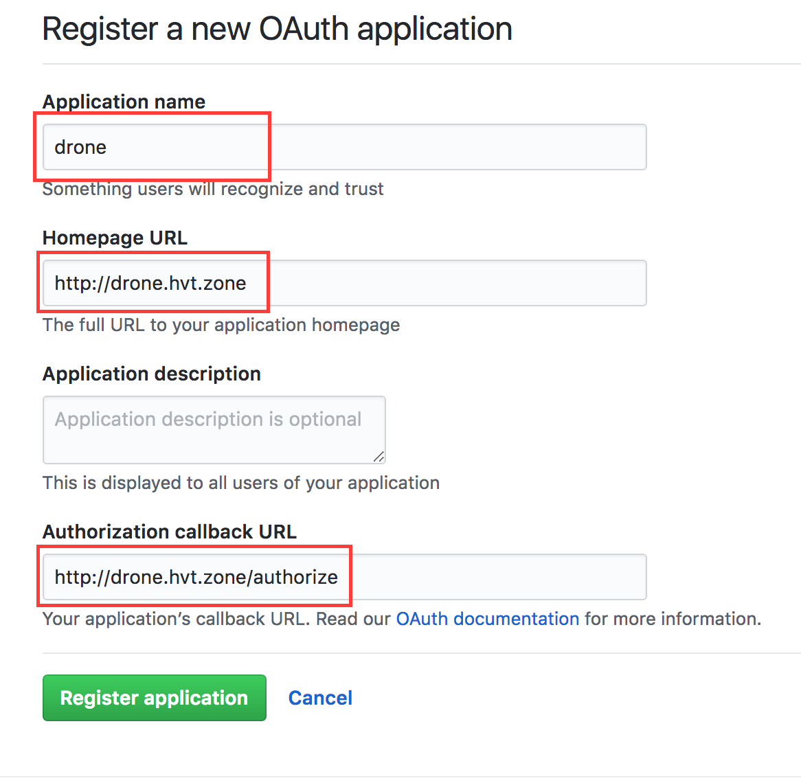
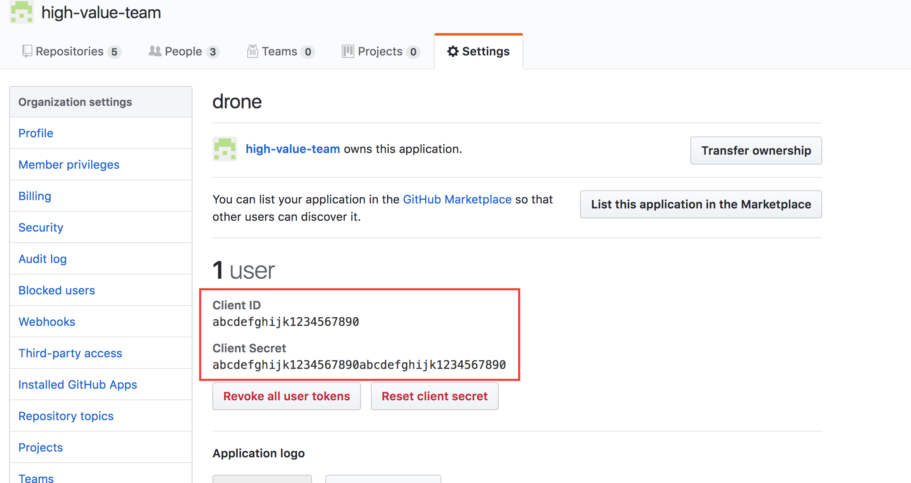
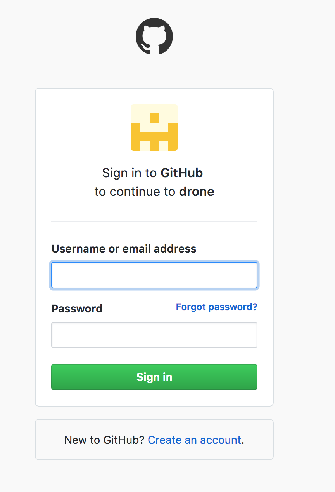

# Setting up Rancher v1.6 on AWS (fully scripted)

Do you want to get started with a simple administration frontend for your Docker containers? Want to give a small introduction to Docker and demonstrate its practical use with a web UI? It takes you 5 minutes to get everything up and running.

This document will guide you through an automated setup so that you can spin up an environment for the next workshop.

features:
* provision and configure EC2 instances
* install rancher 1.6 (rancher server and multiple rancher hosts)
* configure DNS entries in Route53 (e.g. hello.example.com, groupbox.example.com)

bonus features:
* deploy your multi-container Apps to rancher
* install and configure drone.io CI Server


description:


## Table of Content

* [What-is-rancher](#What-is-rancher)
* [Configure-AWS](#Configure-AWS)
* [Execute-Scripts](#Execute-Scripts)
* [Bonus-Features](#Bonus-Features)
* [Closing-Notes](#Closing-Notes)
* [Technologies](#Technologies)
* [sources](#sources)


## What-is-rancher

Rancher is an orchestration plattform that manages your multi-container Docker applications. Rancher extends the default docker-compose.yml functionality with an additional file called rancher-compose.yml (scaling, healthchecks, loadbalancing).


rancher-stacks: Rancher uses the term Stack to describe a multi-container app. Here you can see an app called "groupbox" which consists of three different types of docker containers (rancher uses the term "services"). Stacks can be created with "Add Stack". The community has created a number of useful stacks, which are preconfigured and can be easily installed, like mongodb-replica, apache zookeeper cluster, Drupal, DokuWiki, ...


rancher-loadbalancer: The loadbalancer service can be configured in such a way that it accepts HAProxy statements to direct outside traffic (public server port) to the correct corresponding internal service address (private rancher network, internal server and port). Marked in red is the rule which maps calls to the subdomain groupbox.hvt.zone on port 80 to the groupbox/frontend service on port 80 in the docker container.


rancher-hosts: Three different EC2 instances make up rancher hosts. New Hosts can be easily added, either by running a custom docker container on the host or by using one of the many cloud provider adapters  (e.g. Amazon, Google, DigitalOcean, ...) 


rancher-host: CPU, Memory, Storage, Network


rancher-scaling: Services can be scaled with a single click and rancher will increase/decrease the number of containers of the service. Ever container is accessible with an interactive shell and their docker logs.


rancher-container-shell: Just open the Shell to execute commands right from inside the browser.


rancher-container-logs: The docker logs can also right at your finger tips.


## Configure-AWS

AWS users, permissions, credentials, security groups, ssh keys

Before we can get up and running with our scripts, we need to go to AWS via the web console and create a user, give the user permissions to interact with specific services, and get credentials to identify that user. EC2 instances also need security groups to restrict TCP traffic and to log into the new created instances we will be using ssh-keys which also need to be generated.

### Create-IAM-User

Open your browser and navigate to the AWS login page https://console.aws.amazon.com/console/home.

Once you are logged into the console, navigate to the Identity and Access Management (IAM) console. 


aws-iam-create-user: Select "Users" -> "Add user"


aws-iam-new-user: Give it a proper name and specify programmatic access type.


aws-iam-permissions: Attach existing policies: AmazonEC2FullAccess AmazonRoute53FullAccess


### Create Security Group

Navigate to the Elastic Cloud (EC2) console. 


aws-ec2-create-security-group: Select "Security Groups" -> "Create Security Group"


aws-ec2-create-security-group-new-rule: Spedify open ports for inbound and outbound traffic (for simplicity reasons I chose to make all ports open).


### Create Key Pairs


aws-ec2-create-key-pair: Select "Key Pairs" -> "Create Key Pair"


aws-ec2-create-key-pair-name: provide a suitable name.


## Execute-Scripts


```
cd provision-and-configure-servers

# provide aws ssh-key to login into ec2 instance
cp ~/Downloads/rancher-user.pem id_rsa.pem

# provide usernames, credentials, passwords, security groups, ssh keys
cp run.example run.sh
vi run.sh

# build and execute scripts
docker build --tag provision-and-configure-servers .
docker run provision-and-configure-servers

# stop container if something goes wrong
docker ps
docker stop <container id>
```


aws-provision-done: Once the scrip stops, it will print important environment variables that can be used in the bonus feature steps.


aws-ec2-instances: You should see the newly created instances on your EC2 dashboard. 


aws-route53-hosted-zone-records: The DNS Records will also be modified if the AWS_HOSTED_ZONE_ID has been set in run.sh 


## Bonus-Features

### deploy your docker containers to rancher 

This script will deploy the preconfigured applications on the rancher plattform.

```
cd deploy-hvt-apps

# configure provide credentials, secrets, passwords, usernames, ...
cp run.example run.sh
vi run.sh

# build and execute scripts
docker build --tag deploy-hvt-apps .
docker run deploy-hvt-apps
```

### install and configure drone.io CI Server

Setting up the CI build server is also straightforward following these steps:

* register an "OAuth App" on GitHub 
* customize the environment variables of your drone app
* login to your drone server to get the DRONE_TOKEN.


github-oauth: In your GitHub account go to "Settings" -> "OAuth Apps" -> "New OAuth App"


github-oauth-new: Provide "Application name" and "Authorization callback URL"


github-oauth-created: use these credentials to configure the drone server on the rancher UI


rancher-drone-stack: On the Rancher UI use the contect menu to change the drone settings.


rancher-drone-settings: use the OAuth credentials provided by GitHub.


drone-login: Visit the drone server address (http://drone.hvt.zone in my case) and login with your GitHub account.


drone-menu-token: Click on the burger menu in the upper right hand corner and select "Token"


drone-token: Copy and paste the environment variable DRONE_TOKEN into run.sh (see details steps on the console below)

```
cd configure-drone-ci

# configure provide credentials, secrets, passwords, usernames, ...
cp run.example run.sh
vi run.sh

# build and execute scripts
docker build --tag configure-drone-ci .
docker run configure-drone-ci
```

## Closing-Notes

(pay attention to your credentials, secure your AWS instances)


## Technologies

* Python (boto3, pexpect)
* AWS (aws CLI, EC2, Route53)
* Docker (RancherOS, Rancher 1.6, Rancher CLI)
* Drone (Drone CLI)

## sources

project structure:
* https://www.kennethreitz.org/essays/repository-structure-and-python
* https://stackoverflow.com/a/1783482/5011904

python virtual environment:
* https://docs.python.org/3/tutorial/venv.html#creating-virtual-environments

aws, python and drone:
* https://linuxacademy.com/howtoguides/posts/show/topic/14209-automating-aws-with-python-and-boto3
* http://tleyden.github.io/blog/2016/02/15/setting-up-a-self-hosted-drone-dot-io-ci-server/

python libraries:
* https://boto3.readthedocs.io/en/latest/index.html
* https://pexpect.readthedocs.io/en/stable/

scripting inspiration:
* https://github.com/jeff1evesque/machine-learning/blob/508f572357966d621026ff144731a29c6faed939/install_rancher
* https://gist.github.com/mathuin/ed0fa5666e4f063b94abb5b1a49d9919

automate drone setup
* https://github.com/drone/drone/issues/2129

drone:
* http://docs.drone.io/cli-installation/

rancher:
* https://rancher.com/docs/rancher/v1.6/en/cli/commands/
* https://rancher.com/docs/rancher/v1.6/en/api/v1/
