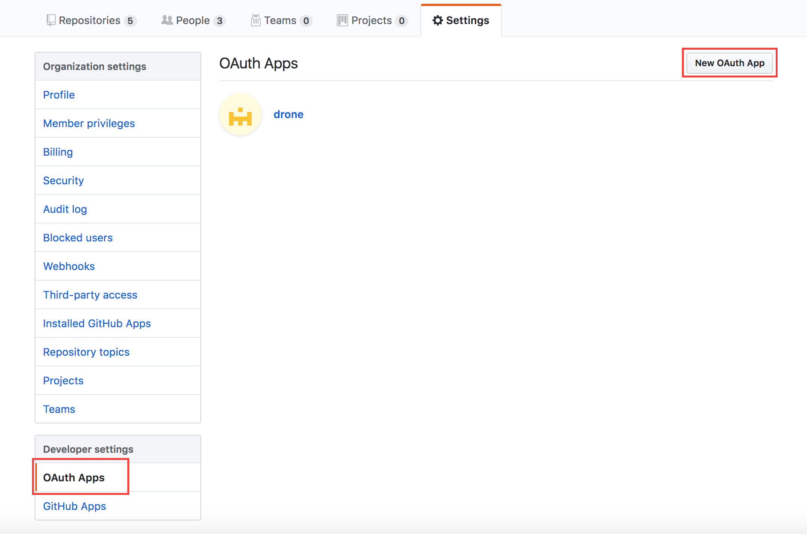
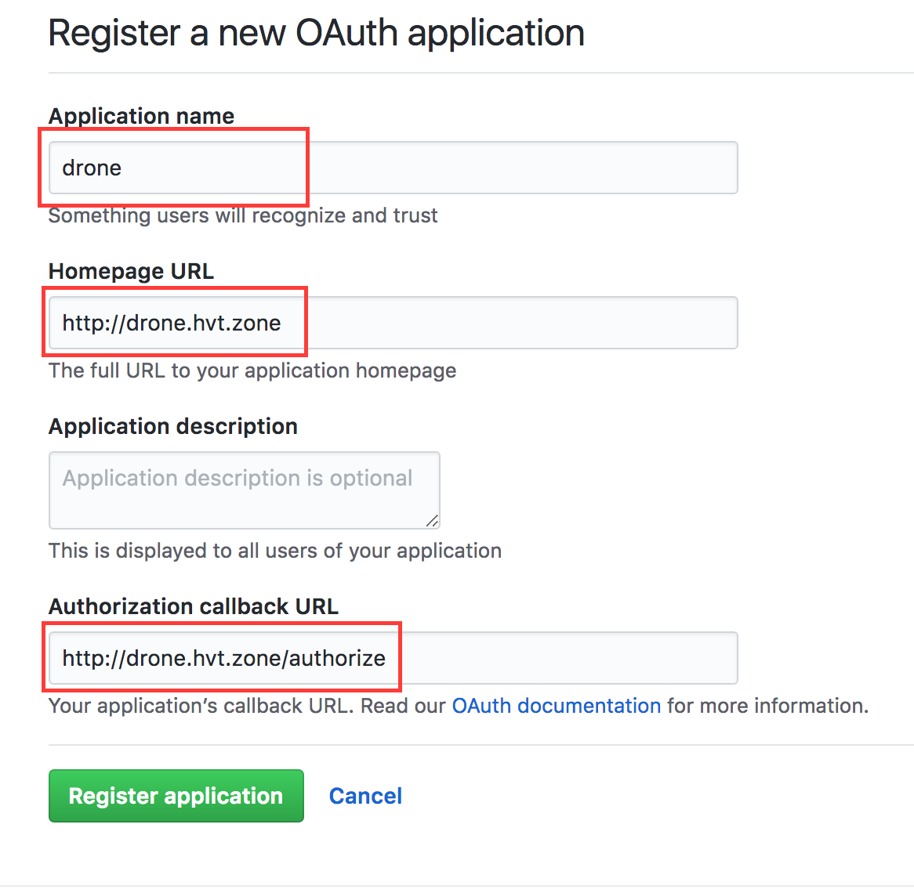
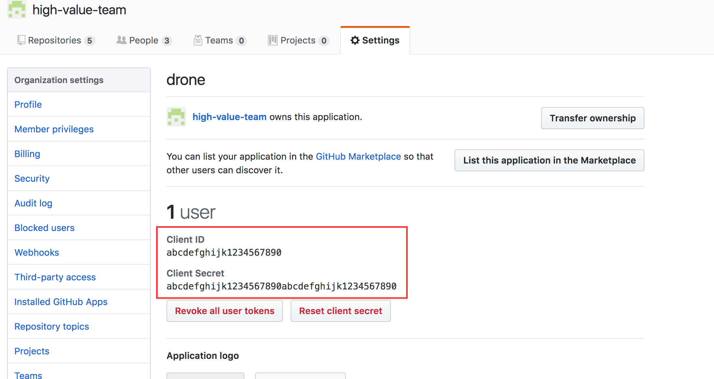
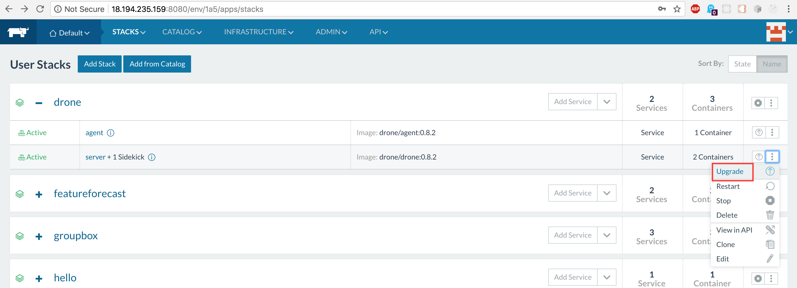
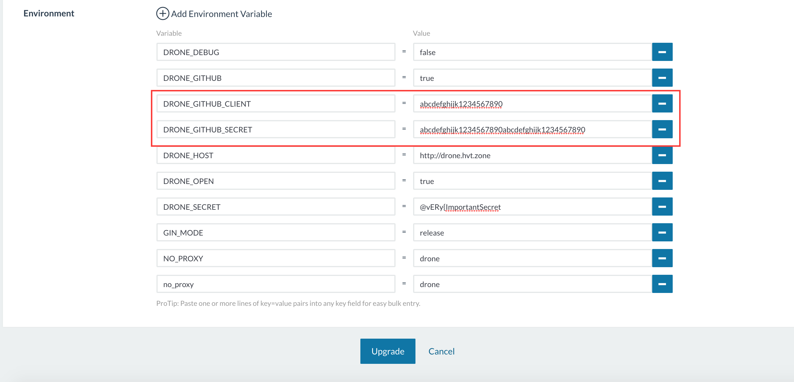
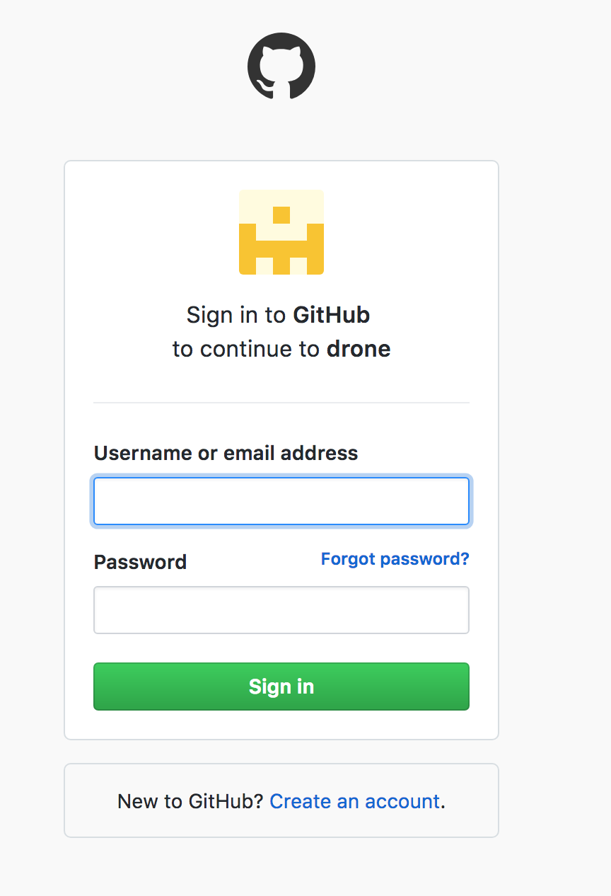
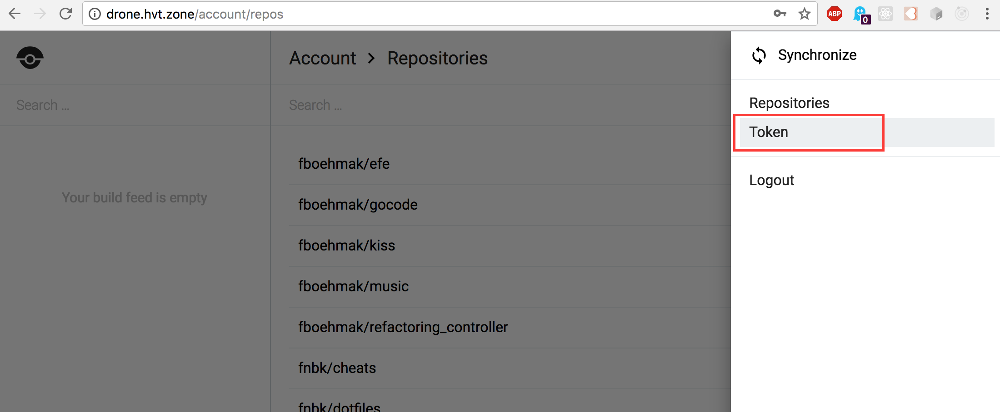
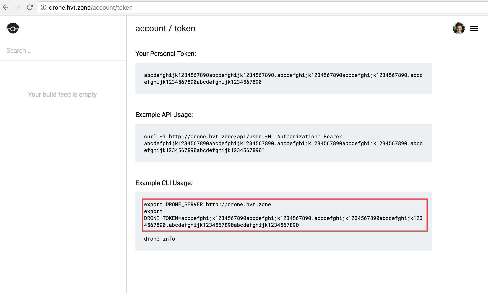

# configure drone.io CI Server

Setting up the CI build server is also straightforward following these steps:

* register an "OAuth App" on GitHub 
* customize the environment variables of your drone app
* login to your drone server to get the DRONE_TOKEN.

github-oauth: In your GitHub account go to "Settings" -> "OAuth Apps" -> "New OAuth App"

github-oauth-new: Provide "Application name" and "Authorization callback URL"

github-oauth-created: use these credentials to configure the drone server on the rancher UI

rancher-drone-stack: On the Rancher UI use the contect menu to change the drone settings.

rancher-drone-settings: use the OAuth credentials provided by GitHub.

drone-login: Visit the drone server address (http://drone.hvt.zone in my case) and login with your GitHub account.

drone-menu-token: Click on the burger menu in the upper right hand corner and select "Token"

drone-token: Copy and paste the environment variable DRONE_TOKEN into run.sh (see details steps on the console below)

drone-jobs: Pipelines to finish may take so time (e.g. 20minutes)
