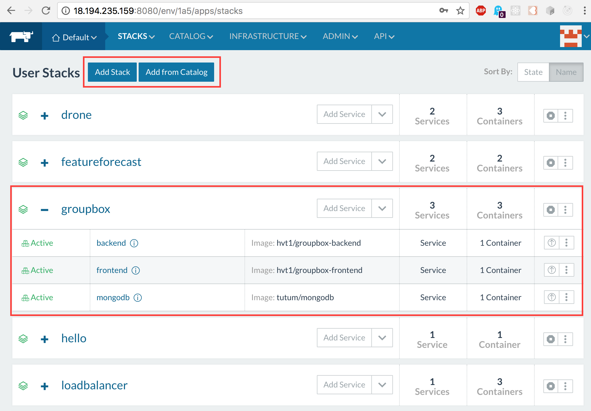
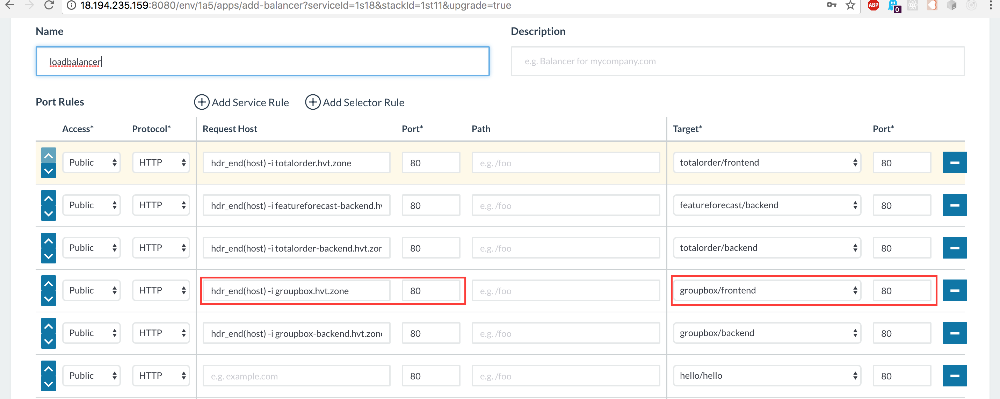
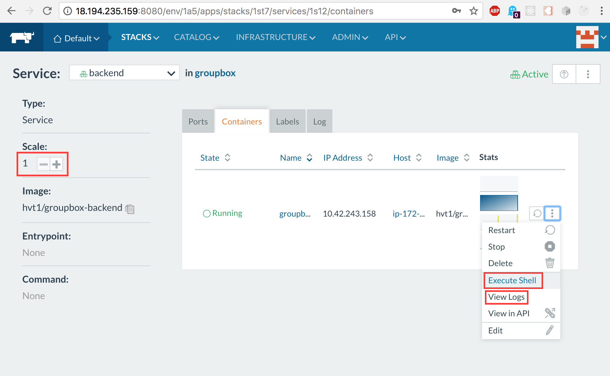

# What-is-rancher

Rancher is an orchestration plattform that manages your multi-container Docker applications. Rancher extends the default docker-compose.yml functionality with an additional file called rancher-compose.yml (scaling, healthchecks, loadbalancing).

rancher-stacks: Rancher uses the term Stack to describe a multi-container app. Here you can see an app called "groupbox" which consists of three different types of docker containers (rancher uses the term "services"). Stacks can be created with "Add Stack". The community has created a number of useful stacks, which are preconfigured and can be easily installed, like mongodb-replica, apache zookeeper cluster, Drupal, DokuWiki, ...

rancher-loadbalancer: The loadbalancer service can be configured in such a way that it accepts HAProxy statements to direct outside traffic (public server port) to the correct corresponding internal service address (private rancher network, internal server and port). Marked in red is the rule which maps calls to the subdomain groupbox.hvt.zone on port 80 to the groupbox/frontend service on port 80 in the docker container.

rancher-hosts: Three different EC2 instances make up rancher hosts. New Hosts can be easily added, either by running a custom docker container on the host or by using one of the many cloud provider adapters  (e.g. Amazon, Google, DigitalOcean, ...) 

rancher-host: CPU, Memory, Storage, Network

rancher-scaling: Services can be scaled with a single click and rancher will increase/decrease the number of containers of the service. Ever container is accessible with an interactive shell and their docker logs.

rancher-container-shell: Just open the Shell to execute commands right from inside the browser.

rancher-container-logs: The docker logs can also right at your finger tips.

